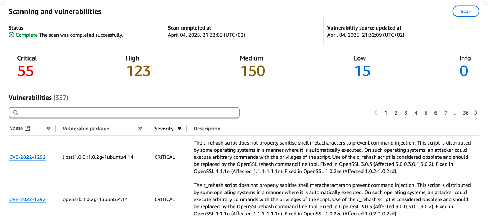

There are a few reasons why you may want to cache container images, when running workloads in AWS, e.g.:

- Reduce image pull times for large images, from other regions or external registries
- Pulling containers from external registries at a frequency that gets you throttled

<!--more-->

## Overview

Docker Hub recently applied some fairly aggressive [pull rate limits](https://docs.docker.com/docker-hub/usage/), especially for unauthenticated users. For non-paid tiers, the following pull rate limits are applied:

- Unauthenticated users: **10 pulls/hour** (per public IPv4 address or IPv6/64 subnet)
- Authenticated users: **100 pulls/hour**

But workloads that experience dramatic scale-ups may also be affected, even when authenticating against external registries, like GitHub.

We can mitigate this by deploying a pull-through cache in Amazon's Eleastic Container Registry, or ECR.

This is done by storing credentials for the external registry in Secrets Manager, setting up an ECR pull-through cache rule and update your container references.

Optionally, we can configure automatic expiration of cached images, organisation-wide access to the cache in AWS and free scanning for security vulnerabilities.

I'm going to show you how this can be done for Docker Hub declaritively using Terraform, but the process is very similar for other supported registries (e.g. GitHub, GitLab, Quay and ECR).

## Basic setup

First we'll define define the variables for the Docker Hub pull secrets, as well as the prefix to use for the cache. The prefix is used for the path to the pull secrets in Secrets Manager, ECR cache prefix and optionally for the access policy.

```hcl
variable "docker_cache_username" {
  description = "Username for pulling images from Docker Hub."
  type        = string
}

variable "docker_cache_token" {
  description = "Access token for pulling images from Docker Hub."
  type        = string
  sensitive   = true
}

locals {
  docker_cache_ecr_prefix = "docker-hub"
}
```

Next, we'll store the supplied credentials in AWS Secrets Manager, to be used when pulling images from upstream:

```hcl
resource "aws_secretsmanager_secret" "docker_cache_creds" {
  name                    = "ecr-pullthroughcache/${local.docker_cache_ecr_prefix}"
  recovery_window_in_days = 0 # allows immediate deletion of secret
}

resource "aws_secretsmanager_secret_version" "docker_cache_creds" {
  secret_id = aws_secretsmanager_secret.docker_cache_creds.id
  secret_string = jsonencode({
    username    = var.docker_cache_username
    accessToken = var.docker_cache_token
  })
}
```

Finally, the actual pull-through cache rule:

```hcl
resource "aws_ecr_pull_through_cache_rule" "docker" {
  ecr_repository_prefix = local.docker_cache_ecr_prefix
  upstream_registry_url = "registry-1.docker.io"
  credential_arn        = aws_secretsmanager_secret.docker_cache_creds.arn
}

output "ecr_cache_prefix" {
  value = {
    docker = "${aws_ecr_pull_through_cache_rule.docker.registry_id}.dkr.ecr.${local.aws_region}.amazonaws.com/${local.docker_cache_ecr_prefix}/"
  }
}

```

## Using the pull-through cache

When referencing an image from Docker Hub, use the cache prefix as output by `ecr_cache_prefix`, e.g.: `111111111111.dkr.ecr.eu-west-1.amazonaws.com/docker-hub/`. It doesn’t matter if this in a manifest for a Kubernetes deployment, Docker compose or something else.

For example:

`repository_name/image_name:tag`

Becomes:

`111111111111.dkr.ecr.eu-west-1.amazonaws.com/docker-hub/repository_name/image_name:tag`

For local development, e.g. using docker pull, run or compose, you first need to obtain a Docker-compatible token through your AWS context:

```bash
aws ecr get-login-password --region eu-west-1 | docker login --username AWS --password-stdin 111111111111.dkr.ecr.eu-west-1.amazonaws.com
```


When pulling from a Docker Hub repository that is tagged as a **Docker Official Image**, you must include the `/library/` in the URI you use.

For example:

`111111111111.dkr.ecr.eu-west-1.amazonaws.com/docker-hub/library/busybox:latest`

If you omit the `/library/` for Docker Hub Official images, a `403 Forbidden` error will be returned when you attempt to pull the image.


See also [Pulling an image with a pull through cache rule in Amazon ECR](https://docs.aws.amazon.com/AmazonECR/latest/userguide/pull-through-cache-working-pulling.html).

### Required permissions

You must use an AWS IAM context (e.g. role, user or instance profile) that has the `ecr:BatchImportUpstreamImage` permission.

For EKS nodes, if you're using the Terraform community EKS module's [`eks-managed-node-group` sub-module](https://registry.terraform.io/modules/terraform-aws-modules/eks/aws/latest/submodules/eks-managed-node-group), you can pass the follwoing `iam_role_policy_statements`:

```hcl
iam_role_policy_statements = [
  {
    sid    = "ECRPullThroughCache"
    effect = "Allow"
    actions = [
      "ecr:BatchImportUpstreamImage"
    ]
    resources = ["*"]
  }
]
```

### Troubleshooting

There are 2 typical issues you may encounter using the pull-through cache:

- **Requested image not found:** Missing the `ecr:BatchImportUpstreamImage` permission
- **403 Forbidden when pulling from a Docker Hub repository:** Append `/library/` to the prefix for Docker Official images

See also [Troubleshooting pull through cache issues in Amazon ECR](https://docs.aws.amazon.com/AmazonECR/latest/userguide/error-pullthroughcache.html).

## Optional configuration

### Automatically delete old images

To prevent every image ever cached to accumulate indefinitely, we can configure a lifecycle policy to automatically delete old images.

```hcl
variable "ecr_cache_lifecycle_days" {
  description = "Days to keep image tags from pull-through cache."
  type        = number
  default     = 7
}

data "aws_ecr_lifecycle_policy_document" "expire_old_images" {
  rule {
    priority    = 1
    description = "Expire old images"
    selection {
      tag_status   = "any"
      count_type   = "sinceImagePushed"
      count_number = var.ecr_cache_lifecycle_days
      count_unit   = "days"
    }
  }
}

resource "aws_ecr_repository_creation_template" "cache" {
  prefix           = "ROOT"
  applied_for      = ["PULL_THROUGH_CACHE"]
  lifecycle_policy = data.aws_ecr_lifecycle_policy_document.expire_old_images.json
}
```

### Organisation-wide access

You can make the registry (or just the pull-through caches) available to your entire AWS Organization.



The access policy applies to the entire registry, but you can modify the `resources` field to limit access to the cache only.


```hcl

locals {
  aws_org_id = "o-abcdefghij" # Replace with your own AWS Organization id
  aws_region = "eu-west-1"    # The region the cache is deployed in
}

data "aws_caller_identity" "current" {}

data "aws_iam_policy_document" "ecr_registry_policy" {
  statement {
    sid = "OrgPullCache"
    actions = [
      "ecr:BatchCheckLayerAvailability",
      "ecr:BatchGetImage",
      "ecr:BatchImportUpstreamImage",
      "ecr:GetDownloadUrlForLayer",
    ]
    resources = ["arn:aws:ecr:${local.aws_region}:${data.aws_caller_identity.current.account_id}:repository/*"]
    principals {
      type        = "AWS"
      identifiers = ["*"]
    }
    condition {
      variable = "aws:PrincipalOrgID"
      test     = "StringLike"
      values   = [local.aws_org_id]
    }
  }
}

resource "aws_ecr_registry_policy" "this" {
  policy = data.aws_iam_policy_document.ecr_registry_policy.json
}
```

Alternatively, if you only want the policy to apply to the Docker Hub cache only:

`resources = ["arn:aws:ecr:${local.aws_region}:${data.aws_caller_identity.current.account_id}:repository/${local.docker_cache_ecr_prefix}/*"]`

### Security scanning of images

Basic image scanning is a free feature you can enable on your AWS ECR registry, which use the Common Vulnerabilities and Exposures (CVEs) database.


The image scanning configuration applies to the entire registry, but you can use filters to limit the specific repos.



```hcl
resource "aws_ecr_registry_scanning_configuration" "this" {
  scan_type = "BASIC"
  rule {
    scan_frequency = "SCAN_ON_PUSH"
    repository_filter {
      filter_type = "WILDCARD"
      filter      = "*"
    }
  }
}
```

Ufortunately, for multi-layers images, the image scanning results are not available on the image tag artifact ("image index" in ECR), but only each individual layer ("image" in ECR). This can make it cumbersome to assess the vulnerabilities of an image.



See also [Scan images for software vulnerabilities in Amazon ECR](https://docs.aws.amazon.com/AmazonECR/latest/userguide/image-scanning.html).

## Alternative approaches

Before provisioning additional infrastructure, you might consider if less restrictive container registries are available for the container images used.

Many projects are pushing their container images to other registries than Docker Hub, e.g. GitHub Packages (`ghcr.io`) - especially projects already hosted on GitHub.

Amazon are also [publishing their official AWS CLI container](https://docs.aws.amazon.com/cli/latest/userguide/getting-started-docker.html) to their own public ECR registry (`public.ecr.aws/aws-cli/aws-cli`), as well as Docker Hub.

The AWS Public Gallery also includes popular containers like Ubuntu, Nginx, Python etc.
