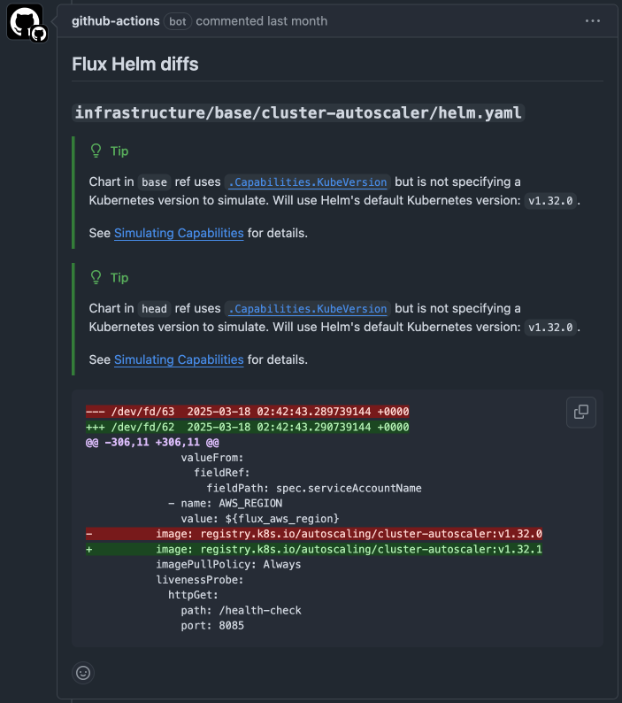

It can be difficult to review pull requests on [Flux CD](https://fluxcd.io/) Helm manifests that bump a chart version, slightly change the supplied values and other changes.

With my [**Flux Helm Diff**](https://github.com/marketplace/actions/flux-helm-diff) GitHub Action, you can get the diff posted automatically as a comment on the PR, making reviews a lot smoother.

<!--more-->

## Filling a niche

There are other cool tools that does something similar, the [`diff` plugin](https://github.com/databus23/helm-diff) for Helm for instance. But the tools I've come across all seem to compare the manifests against what's installed on a particular cluster, thus requiring network connection and credentials.

I wanted to determine the resulting difference to the rendered manifests introduced by the PR, without needing access to a cluster - 100% client-side. So I created this simple GitHub Action, consistingly mainly of shell scripts.

Combined with the dependency update tool [Renovate](https://github.com/renovatebot/renovate), and other neat GitHub Actions, it's a breeze to keep our apps deployed via Helm at work up-to-date!

## How it works

Helm charts are just fancy Kubernetes manifests templates. The GitHub Action checks out the branch of the pull request ("head") and its "base", usually "main". For every updated `helm.yaml` file, it extracts the repo URL, chart name and version and values, then renders all the resulting Kubernetes manifests, for both "head" and "base". Finally it outputs the "diff" for each changed Helm chart.

What you do with the output is up to you, but I like to use [`mshick/add-pr-comment`](https://github.com/marketplace/actions/add-pr-comment) to add the diff as a comment to the PR, like so:

For detailed information on how to use this action, including how to simulate Kubernetes capabilities, required to accurately render certain charts, check it out [**Flux Helm Diff**](https://github.com/marketplace/actions/flux-helm-diff) on the GitHub Action marketplace.

## Future

The GitHub Action pretty much works as intended as it is. And we actively use it at my job to help make the PRs for our regular maintenance days a lot more "reviewable". However, the major limitation I've encountered, is that it [expects each Helm chart, and its source, to be stored in a single file](https://github.com/abstrask/flux-helm-diff/issues/15) named `helm.yaml`.

This has worked fine for a long time for us (and may also for you), until we needed to deploy multiple instances of External DNS, using the same source. We needed that to support domains hosted in different AWS accounts. As a result, the Helm source and Helm release are defined in separate files, and the GHA is currently not able to produce a diff.

I hope you'll find it useful.. But if you find any other shortcomings, please let me know in the [issues](https://github.com/abstrask/flux-helm-diff/issues).
